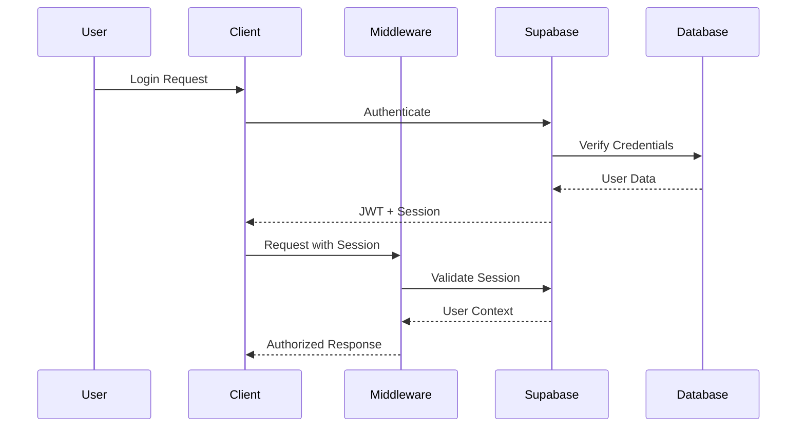

# Security Documentation

**Last Updated**: December 21, 2025  
**Version**: 1.0.0  
**Status**: Active

## Table of Contents

- [Security Architecture Overview](#security-architecture-overview)
- [Authentication and Authorization](#authentication-and-authorization)
- [Input Validation and Sanitization](#input-validation-and-sanitization)
- [Database Security](#database-security)
- [API Security Best Practices](#api-security-best-practices)
- [Security Headers](#security-headers)
- [Logging and Monitoring](#logging-and-monitoring)
- [Incident Response Procedures](#incident-response-procedures)
- [Security Checklist](#security-checklist)
- [Configuration](#configuration)

## Security Architecture Overview

Structura implements a **defense-in-depth** security strategy with multiple layers of protection:

```
┌─────────────────────────────────────────────────────────────┐
│                    Client Browser                           │
├─────────────────────────────────────────────────────────────┤
│  Security Headers | CSP | CORS | Cookie Security           │
├─────────────────────────────────────────────────────────────┤
│                 Next.js Middleware                          │
│  Rate Limiting | Session Management | CSRF Protection      │
├─────────────────────────────────────────────────────────────┤
│                   API Routes                                │
│  Input Validation | Authentication | Authorization         │
├─────────────────────────────────────────────────────────────┤
│                 Service Layer                               │
│  Business Logic | Error Handling | Audit Logging          │
├─────────────────────────────────────────────────────────────┤
│                 Database Layer                              │
│  Row Level Security | Encryption | Backup Security         │
└─────────────────────────────────────────────────────────────┘
```

### Core Security Principles

1. **Zero Trust**: Never trust, always verify
2. **Least Privilege**: Minimum necessary permissions
3. **Defense in Depth**: Multiple security layers
4. **Fail Secure**: Secure defaults and graceful failures
5. **Security by Design**: Security built into architecture

### Security Configuration

All security settings are configured in `src/config/security.ts`:

```typescript
import { SECURITY_CONFIG } from '@/config/security'

// Access security configurations
const headers = SECURITY_CONFIG.getSecurityHeaders()
const cookieConfig = SECURITY_CONFIG.cookies.auth
const rateLimits = SECURITY_CONFIG.rateLimit.auth
```

## Authentication and Authorization

### Authentication Flow



### Authentication Security Features

#### Session Management

- **Secure Cookies**: HttpOnly, Secure, SameSite protection
- **Session Rotation**: Automatic token refresh
- **Session Timeout**: Configurable expiration
- **Multi-device Support**: Concurrent session management

```typescript
// Session configuration
const sessionConfig = SECURITY_CONFIG.cookies.session
// {
//   httpOnly: true,
//   secure: true, // HTTPS only in production
//   sameSite: 'strict',
//   maxAge: 86400 // 24 hours
// }
```

#### Password Security

- **Minimum Requirements**: 8+ characters, complexity rules
- **Hashing**: Supabase handles bcrypt hashing
- **Password Reset**: Secure token-based reset flow
- **Rate Limiting**: Protection against brute force attacks

#### Multi-Factor Authentication (MFA)

- **Email Verification**: Required for account activation
- **TOTP Support**: Time-based one-time passwords (planned)
- **Recovery Codes**: Backup authentication methods (planned)

### Authorization Model

#### Role-Based Access Control (RBAC)

```sql
-- User roles in database
CREATE TYPE user_role AS ENUM ('user', 'admin', 'moderator');

-- Role-based policies
CREATE POLICY "Admin full access" ON profiles
  FOR ALL USING (
    auth.jwt() ->> 'role' = 'admin'
  );
```

#### Row Level Security (RLS)

All user data tables implement RLS policies:

```sql
-- Users can only access their own data
CREATE POLICY "Users own data" ON profiles
  FOR ALL USING (auth.uid() = id);

-- Admins can access all data
CREATE POLICY "Admin access" ON profiles
  FOR ALL USING (
    auth.jwt() ->> 'role' = 'admin'
  );
```

## Input Validation and Sanitization

### Validation Strategy

1. **Client-side Validation**: User experience and immediate feedback
2. **Server-side Validation**: Security enforcement (never trust client)
3. **Database Constraints**: Final data integrity layer

### Validation Implementation

#### Zod Schema Validation

```typescript
import { z } from 'zod'

// Email validation with sanitization
export const emailSchema = z.string().email('Invalid email format').toLowerCase().trim()

// Password validation with security requirements
export const passwordSchema = z
  .string()
  .min(8, 'Password must be at least 8 characters')
  .max(100, 'Password too long')
  .regex(/[A-Z]/, 'Must contain uppercase letter')
  .regex(/[a-z]/, 'Must contain lowercase letter')
  .regex(/[0-9]/, 'Must contain number')
```

#### File Upload Security

```typescript
// File validation using centralized config
import { SECURITY_CONFIG } from '@/config/security'

function validateFile(file: File) {
  const config = SECURITY_CONFIG.validation.files

  // Size validation
  if (file.size > config.maxSize) {
    throw new Error(`File too large: ${file.size} > ${config.maxSize}`)
  }

  // Type validation
  if (!config.allowedTypes.includes(file.type)) {
    throw new Error(`Invalid file type: ${file.type}`)
  }

  // Extension validation
  const ext = file.name.split('.').pop()?.toLowerCase()
  if (!ext || !config.allowedExtensions.includes(`.${ext}`)) {
    throw new Error(`Invalid file extension: .${ext}`)
  }
}
```

### Input Sanitization

#### HTML/XSS Prevention

```typescript
import DOMPurify from 'dompurify'

// Sanitize HTML content
function sanitizeHtml(input: string): string {
  return DOMPurify.sanitize(input, {
    ALLOWED_TAGS: ['b', 'i', 'em', 'strong', 'p', 'br'],
    ALLOWED_ATTR: [],
  })
}

// Escape for safe HTML output
function escapeHtml(input: string): string {
  return input
    .replace(/&/g, '&amp;')
    .replace(/</g, '&lt;')
    .replace(/>/g, '&gt;')
    .replace(/"/g, '&quot;')
    .replace(/'/g, '&#x27;')
}
```

#### SQL Injection Prevention

- **Parameterized Queries**: Supabase client handles parameterization
- **Input Validation**: All inputs validated before database operations
- **Stored Procedures**: Complex operations use stored procedures

```typescript
// Safe database query (Supabase handles parameterization)
const { data, error } = await supabase.from('profiles').select('*').eq('id', userId) // Automatically parameterized
```

## Database Security

### Row Level Security (RLS)

#### RLS Policy Examples

```sql
-- Profile access policies
ALTER TABLE profiles ENABLE ROW LEVEL SECURITY;

-- Users can view/edit their own profile
CREATE POLICY "Own profile access" ON profiles
  FOR ALL USING (auth.uid() = id);

-- Admins can access all profiles
CREATE POLICY "Admin profile access" ON profiles
  FOR ALL USING (
    EXISTS (
      SELECT 1 FROM profiles
      WHERE id = auth.uid()
      AND role = 'admin'
    )
  );

-- Public profile viewing (limited fields)
CREATE POLICY "Public profile view" ON profiles
  FOR SELECT USING (
    is_public = true
  );
```

#### RLS Best Practices

1. **Enable RLS on all user data tables**
2. **Test policies thoroughly**
3. **Use least privilege principle**
4. **Regular policy audits**
5. **Monitor policy performance**

### Data Encryption

#### Encryption at Rest

- **Database Encryption**: Supabase provides automatic encryption
- **File Storage**: Supabase Storage encrypts all files
- **Backup Encryption**: All backups are encrypted

#### Encryption in Transit

- **HTTPS Only**: All connections use TLS 1.2+
- **Database Connections**: Encrypted connections to PostgreSQL
- **API Communications**: All API calls over HTTPS

### Database Security Checklist

- [ ] RLS enabled on all user data tables
- [ ] Policies tested for all user roles
- [ ] No direct database access from client
- [ ] Regular security updates applied
- [ ] Database backups encrypted and tested
- [ ] Connection strings secured
- [ ] Database monitoring enabled

## API Security Best Practices

### Rate Limiting

Rate limiting protects against brute force attacks and API abuse. The system supports multiple storage backends for different deployment scenarios.

#### Configuration

Rate limiting is configured per endpoint type:

```typescript
// Authentication endpoints: 5 attempts per 15 minutes
const authLimit = SECURITY_CONFIG.rateLimit.auth

// General API: 100 requests per 15 minutes
const apiLimit = SECURITY_CONFIG.rateLimit.api

// File uploads: 10 uploads per hour
const uploadLimit = SECURITY_CONFIG.rateLimit.upload
```

#### Storage Backends

**Development (In-Memory)**

- Automatic for local development
- No configuration required
- Data lost on server restart

**Production (Persistent Storage)**

For production deployments with multiple instances, configure persistent storage:

**Option 1: Vercel KV (Recommended for Vercel)**

```bash
# Environment variables
KV_REST_API_URL=your_vercel_kv_rest_api_url
KV_REST_API_TOKEN=your_vercel_kv_rest_api_token
```

**Option 2: Redis (Other Deployments)**

```bash
# Redis URL
REDIS_URL=redis://your-redis-host:6379

# Or individual settings
REDIS_HOST=localhost
REDIS_PORT=6379
REDIS_PASSWORD=your_redis_password
```

#### Implementation

```typescript
import { rateLimiters } from '@/lib/security/rate-limit'

// Apply rate limiting in middleware
export async function middleware(request: NextRequest) {
  if (request.nextUrl.pathname.startsWith('/api/auth/')) {
    const response = await rateLimiters.auth(request)
    if (response.status === 429) return response
  }
}

// Apply to API routes
import { withRateLimit } from '@/lib/security/rate-limit'

export const POST = withRateLimit('auth', async (request) => {
  // Your API logic
})
```

#### Monitoring

Rate limiting includes comprehensive logging:

- Failed attempts with IP and user agent
- Rate limit exceeded events
- Configuration validation warnings

### API Security Headers

All API responses include security headers:

```typescript
import { SECURITY_CONFIG } from '@/config/security'

// Apply security headers to API response
const headers = SECURITY_CONFIG.getSecurityHeaders()
Object.entries(headers).forEach(([key, value]) => {
  response.headers.set(key, value)
})
```

### CORS Configuration

```typescript
// CORS settings from centralized config
const corsConfig = SECURITY_CONFIG.cors
// {
//   origins: ['https://yourdomain.com'],
//   methods: ['GET', 'POST', 'PUT', 'DELETE'],
//   credentials: true,
//   maxAge: 86400
// }
```

### API Authentication

#### JWT Token Validation

```typescript
// Middleware validates JWT tokens
export async function validateApiToken(request: NextRequest) {
  const token = request.headers.get('Authorization')?.replace('Bearer ', '')

  if (!token) {
    return new Response('Unauthorized', { status: 401 })
  }

  // Supabase validates JWT automatically
  const supabase = createClient()
  const {
    data: { user },
    error,
  } = await supabase.auth.getUser(token)

  if (error || !user) {
    return new Response('Invalid token', { status: 401 })
  }

  return user
}
```

## Security Headers

### Content Security Policy (CSP)

CSP prevents XSS attacks by controlling resource loading:

```typescript
// CSP configuration
const cspConfig = SECURITY_CONFIG.csp
// {
//   defaultSrc: ["'self'"],
//   scriptSrc: ["'self'", "'nonce-{NONCE}'"],
//   styleSrc: ["'self'", "'unsafe-inline'"],
//   imgSrc: ["'self'", "data:", "https:"],
//   connectSrc: ["'self'", "https://*.supabase.co"]
// }
```

### Security Headers Reference

| Header                      | Purpose                      | Configuration                                  |
| --------------------------- | ---------------------------- | ---------------------------------------------- |
| `Content-Security-Policy`   | Prevent XSS attacks          | Strict policy with nonce support               |
| `X-Frame-Options`           | Prevent clickjacking         | `DENY`                                         |
| `X-Content-Type-Options`    | Prevent MIME sniffing        | `nosniff`                                      |
| `X-XSS-Protection`          | Legacy XSS protection        | `1; mode=block`                                |
| `Strict-Transport-Security` | Force HTTPS                  | `max-age=31536000; includeSubDomains; preload` |
| `Referrer-Policy`           | Control referrer information | `strict-origin-when-cross-origin`              |
| `Permissions-Policy`        | Control browser features     | Restrictive policy                             |

## Logging and Monitoring

### Security Event Logging

#### Critical Security Events

Always logged regardless of environment:

- Authentication failures
- Authorization failures
- Suspicious activity
- Rate limit exceeded
- CSRF token mismatch
- Invalid sessions
- Privilege escalation attempts

#### Production Security Events

Logged only in production:

- Successful logins
- Password changes
- Email verifications
- Profile updates

### Log Sanitization

PII fields are automatically sanitized:

```typescript
import { SECURITY_CONFIG } from '@/config/security'

function sanitizeLogData(data: Record<string, any>) {
  const sanitized = { ...data }

  SECURITY_CONFIG.logging.piiFields.forEach((field) => {
    if (sanitized[field]) {
      sanitized[field] = '[REDACTED]'
    }
  })

  return sanitized
}
```

### Security Monitoring

#### Anomaly Detection

- Failed login attempts > 10/hour
- Rapid requests > 100/minute
- Unusual user agent patterns
- Suspicious IP patterns

#### Alerting

- Critical security events trigger immediate alerts
- Anomaly detection triggers investigation alerts
- System health monitoring for security components

## Incident Response Procedures

### Security Incident Classification

#### Severity Levels

1. **Critical**: Active attack, data breach, system compromise
2. **High**: Potential security vulnerability, suspicious activity
3. **Medium**: Security policy violation, configuration issue
4. **Low**: Security awareness, minor policy deviation

### Incident Response Steps

#### 1. Detection and Analysis

- Monitor security logs and alerts
- Analyze suspicious activity patterns
- Determine incident severity and scope

#### 2. Containment

- Isolate affected systems
- Revoke compromised credentials
- Block malicious IP addresses
- Preserve evidence

#### 3. Eradication

- Remove malicious code or unauthorized access
- Patch vulnerabilities
- Update security configurations
- Strengthen affected systems

#### 4. Recovery

- Restore systems from clean backups
- Monitor for continued threats
- Gradually restore normal operations
- Validate system integrity

#### 5. Post-Incident Review

- Document lessons learned
- Update security procedures
- Improve detection capabilities
- Conduct security training

### Emergency Contacts

```typescript
// Emergency response configuration
const EMERGENCY_CONTACTS = {
  security: 'security@yourdomain.com',
  admin: 'admin@yourdomain.com',
  legal: 'legal@yourdomain.com',
  external: {
    sentry: 'https://sentry.io/alerts',
    hosting: 'support@vercel.com',
  },
}
```

## Security Checklist

### Pre-Deployment Security Checklist

#### Configuration

- [ ] Security configuration validated (`SECURITY_CONFIG.validateSecurityConfig()`)
- [ ] Environment variables secured
- [ ] HTTPS enforced in production
- [ ] Security headers configured
- [ ] CSP policy tested and working

#### Authentication & Authorization

- [ ] RLS policies enabled on all user tables
- [ ] Authentication flows tested
- [ ] Session management working correctly
- [ ] Password requirements enforced
- [ ] Rate limiting configured

#### Input Validation

- [ ] All inputs validated server-side
- [ ] File upload restrictions in place
- [ ] SQL injection prevention verified
- [ ] XSS prevention tested
- [ ] CSRF protection enabled

#### Monitoring & Logging

- [ ] Security event logging configured
- [ ] PII sanitization working
- [ ] Error tracking (Sentry) configured
- [ ] Anomaly detection rules active
- [ ] Log retention policies set

#### Infrastructure

- [ ] Database backups encrypted and tested
- [ ] Secrets management configured
- [ ] Network security configured
- [ ] Dependency vulnerabilities scanned
- [ ] Security updates applied

### Regular Security Maintenance

#### Weekly

- [ ] Review security logs
- [ ] Check for failed authentication attempts
- [ ] Monitor rate limiting effectiveness
- [ ] Review anomaly detection alerts

#### Monthly

- [ ] Update dependencies
- [ ] Review and test RLS policies
- [ ] Audit user permissions
- [ ] Test backup and recovery procedures
- [ ] Review security configurations

#### Quarterly

- [ ] Conduct security assessment
- [ ] Review and update security documentation
- [ ] Test incident response procedures
- [ ] Security training for team
- [ ] Third-party security audit (if applicable)

## Configuration

### Environment Variables

Required security-related environment variables:

```bash
# Supabase Configuration
NEXT_PUBLIC_SUPABASE_URL=https://your-project.supabase.co
NEXT_PUBLIC_SUPABASE_ANON_KEY=your-anon-key
SUPABASE_SERVICE_ROLE_KEY=your-service-role-key

# Security Configuration
NODE_ENV=production
NEXTAUTH_SECRET=your-nextauth-secret
NEXTAUTH_URL=https://yourdomain.com
CSRF_SECRET=your-csrf-secret-32-chars-minimum

# Rate Limiting Storage (Production - choose one)
KV_REST_API_URL=your-vercel-kv-rest-api-url
KV_REST_API_TOKEN=your-vercel-kv-rest-api-token
# OR
REDIS_URL=redis://your-redis-host:6379

# Monitoring
SENTRY_DSN=your-sentry-dsn
SENTRY_ORG=your-sentry-org
SENTRY_PROJECT=your-sentry-project

# Optional Security Features
ENABLE_RATE_LIMITING=true
ENABLE_CSRF_PROTECTION=true
SECURITY_HEADERS_STRICT=true
```

### Security Configuration Validation

```typescript
import { SECURITY_CONFIG } from '@/config/security'

// Validate configuration on startup
const validation = SECURITY_CONFIG.validateSecurityConfig()

if (!validation.isValid) {
  console.error('Security configuration errors:', validation.errors)
  process.exit(1)
}
```

## Related Documentation

- [API Documentation](./api.md) - API security implementation
- [Architecture Documentation](./architecture.md) - System architecture and security
- [Supabase Integration](../src/lib/supabase/README.md) - Database security and RLS
- [Error Handling](../src/lib/error/README.md) - Secure error handling
- [Security Configuration](../src/config/security.ts) - Centralized security config

---

**Document Maintainer**: Security Team  
**Review Schedule**: Monthly  
**Next Review**: January 21, 2026  
**Classification**: Internal Use
